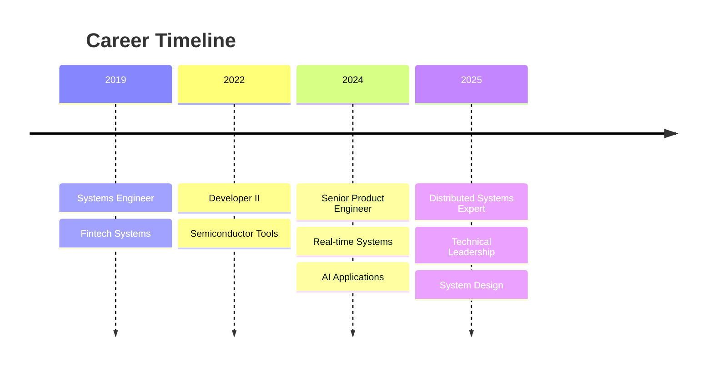
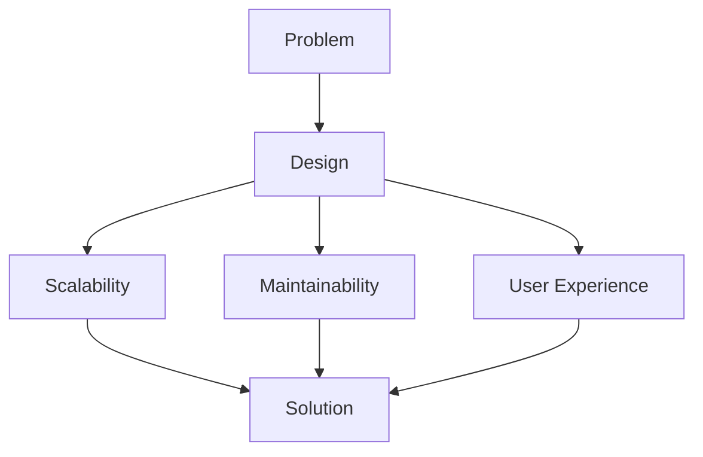

<div align="center">

# Rupayan Roy

**Software Engineer**

Building scalable distributed systems and full-stack applications

<br>

[](https://linkedin.com/in/rupayan-roy)
[](mailto:rupayan.roy16@gmail.com)

</div>

<br>

---

<br>

## About Me

Full-stack engineer with 6+ years of experience building distributed systems, microservices architecture, and real-time applications across pharmaceutical, semiconductor, and fintech domains.

I specialize in designing scalable backend systems while maintaining a strong focus on **UI/UX** and frontend development. My approach to **problem-solving** combines technical depth with user-centric design thinking.

<br>

---

<br>

## Journey



<br>

---

<br>

## Technical Stack

<br>

### Backend & Architecture


- Distributed systems and microservices architecture
- RESTful APIs and real-time streaming (SSE, WebRTC)
- Event-driven architecture and asynchronous processing
- OIDC authentication and RBAC implementation

<br>

### Frontend


- Component-driven architecture
- State management for real-time applications
- Mobile-responsive design
- VS Code extension development

<br>

### Infrastructure & Data


<br>

---

<br>

## Featured Projects

<br>

### Real-Time AI Voice Agent

Built a production voice agent using GPT-realtime API with sub-150ms latency. Migrated from WebSocket to WebRTC for performance optimization, implemented Azure NER for PII redaction ensuring HIPAA compliance.

**Stack:** React, TypeScript, WebRTC, GPT-realtime API, Azure NER

<br>

### High-Performance Streaming Architecture

Engineered real-time streaming microservices using Server-Sent Events. Achieved 80% TTFB reduction (30s → 6s) and 5x concurrency scaling through asynchronous ASGI framework migration.

**Stack:** React, FastAPI, PostgreSQL, Redis Streams, Event-Driven Architecture

```
Performance: 30s → 6s TTFB (80% improvement)
Concurrency: 5x scaling improvement
```

<br>

### VS Code Extension for Semiconductor Design

Developed custom IDE extension using WebView APIs for Meta Description Language. Built Python backend with RESTful APIs for automated hardware configuration.

**Stack:** TypeScript, VS Code API, Python, MVVM Architecture

<br>

### Zero-Downtime Database Migration

Led MySQL to AWS RDS migration for fintech reconciliation system. Reduced failover from 15 minutes to 90 seconds, migrated CI/CD from Jenkins to AWS CodePipeline.

**Stack:** MySQL, AWS RDS, AWS CodePipeline

<br>

---

<br>

## Engineering Principles



<br>

**Scalability** - Design systems that grow gracefully

**Maintainability** - Write code that's readable six months later

**User Experience** - Technical excellence meets intuitive design

<br>

---

<br>

## Let's Connect

Interested in discussing system design, distributed architectures, or collaborating on projects? Feel free to reach out.

<br>

<div align="center">

*Building systems that scale, code that lasts, experiences that matter*

</div>
